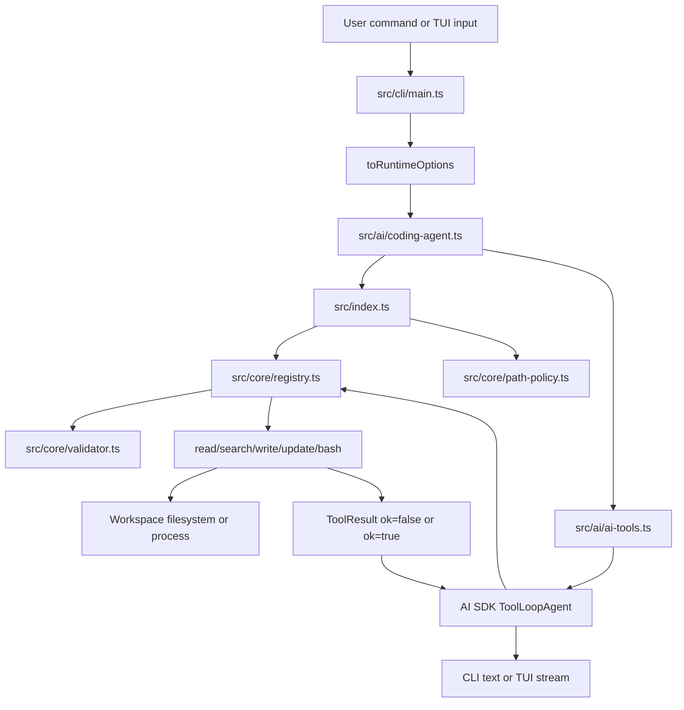
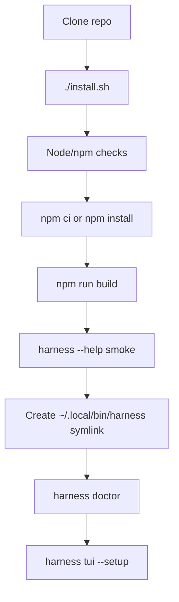

# Harness architecture

This document is the maintainer map for the five-tool coding harness. Start here before changing behavior.

## Reading order

1. `src/cli/main.ts` - command-line entry point, options, and command routing.
2. `src/tui/ai-tui.ts` - terminal UI boot path and renderer patch timing.
3. `src/ai/coding-agent.ts` - shared AI loop configuration used by CLI and TUI.
4. `src/ai/ai-tools.ts` - adapter from internal tools to AI SDK tools and approval policy.
5. `src/index.ts` - harness factory that wires the registry and workspace policy.
6. `src/core/*` - reusable primitives: registry, path policy, validation, hashing, line indexing, file store, logging.
7. `src/tools/*` - the five tool implementations: `read`, `search`, `write`, `update`, `bash`.
8. `src/tui/slash-agent.ts`, `src/tui/provider-setup.ts`, `src/tui/session-store.ts` - local TUI commands, setup screen, and session persistence.
9. `benchmarks/correctness.ts` - behavior checks that protect the public contract.

## Runtime entry points

| Entry point | Purpose |
| --- | --- |
| `harness ai --prompt ...` | Runs one model request and prints the final answer. |
| `harness tui` | Starts the interactive terminal UI with provider setup, approvals, slash commands, and resumable sessions. |
| `harness sessions` | Lists saved TUI sessions from the local session store. |
| `harness doctor` | Checks local install/build/PATH/provider setup without mutating files or contacting a provider. |
| `./install.sh` | Installs dependencies, builds TypeScript, smoke-checks CLI help, creates a symlink, and runs `doctor`. |

## High-level data flow

The invariant: the AI SDK sees only typed tool adapters. Actual workspace access always goes through `ToolRegistry`, schema validation, and `WorkspacePathPolicy`.

## Core responsibilities

### `src/core/registry.ts`

`ToolRegistry` is the dispatch boundary. It owns:

- lookup by tool name,
- JSON schema validation through `SchemaValidator`,
- child logger scope per tool,
- timing,
- normalization of thrown `ToolError` into `ToolResult` failures.

Tools should throw `ToolError` for expected user/model recoverable failures and ordinary errors for unexpected defects.

### `src/core/path-policy.ts`

`WorkspacePathPolicy` resolves user/model paths inside one workspace root. Tool implementations must call it before reading, writing, or executing in a path supplied by the model.

### `src/core/file-store.ts`

`NodeFileStore` centralizes text I/O and atomic writes. `write` and `update` use it so durability behavior stays consistent.

### `src/core/line-index.ts`

`LineIndex` is the source of truth for line-based slices and range hashes. `read` returns hashes from it; `update` verifies those hashes before writing.

## Tool contracts

| Tool | Module | Contract |
| --- | --- | --- |
| `read` | `src/tools/read-tool.ts` | Reads a directory listing or UTF-8 file slice. Returns `fileHash` and `rangeHash` for safe `update`. |
| `search` | `src/tools/search-tool.ts` | Runs bundled ripgrep inside the workspace and returns compact matches. Use before `read` when the target file is unknown. |
| `write` | `src/tools/write-tool.ts` | Creates a file or intentionally overwrites with `overwrite=true`. Uses atomic writes and returns a diff summary. |
| `update` | `src/tools/update-tool.ts` | Applies non-overlapping line replacements only when file hash and per-range hashes still match. |
| `bash` | `src/tools/bash-tool.ts` | Runs one focused non-interactive shell command in the workspace. Non-zero exits are normal results; spawn failures and timeouts are tool errors. |

All tool and reasoning cards use the referenced boxed TUI grammar: command/status row, labeled separator (`├─── Output ─` / `Diff` / `Live status` / `Reasoning`), bounded rows, and footer metrics such as `⟦Wall: 3.11s | Timeout: 120s⟧`. `write` and `update` specialize the box with a line diff, `todo` renders current/pending/done/blocked phase trees, `subagent` renders live role/goal/status cards before the final summary, and streamed reasoning renders as `Think · live` with a live reasoning footer.

The public promise is exactly five workspace tools. `todo` and `subagent` are AI-loop helpers: `todo` exposes progress to the user and `subagent` performs read-only context offload. Neither helper expands the workspace mutation surface.

## AI loop data flow

1. CLI/TUI options become `OpenAICompatibleCodingAgentOptions`.
2. `createOpenAICompatibleCodingAgent` creates:
   - one `ToolRegistry`,
   - one `WorkspacePathPolicy`,
   - one OpenAI-compatible chat model,
   - one AI tool bundle,
   - one `ToolLoopAgent`.
3. `createCodingInstructions` builds model instructions from base rules plus optional workspace markdown files.
4. For non-trivial work the main agent follows the context-preserving loop: analyze user input and project shape, create or normalize a visible todo list, delegate the next context-heavy research/review/plan task, validate the compact subagent handoff, edit or re-delegate when the handoff is wrong, verify the task, then mark todo state and continue.
5. Todo calls enter `src/ai/todo-tool.ts`, which normalizes rich phased input, flat task arrays, and markdown-ish text into one bounded `TodoOutput`.
6. `ToolLoopAgent` streams model steps.
7. Tool calls enter `createAiToolBundle` adapters.
8. Adapters call `registry.run(toolName, input, context)` for workspace tools; `todo` and `subagent` stay in the AI adapter layer.
9. Registry validates input, executes the tool, logs, and returns a compact `ToolResult`.
10. Subagent calls run a separate read-only `ToolLoopAgent` with only `search` and `read`; its final handoff is bounded to 80 lines / 5000 characters before it returns to the main context.
11. Failed tool results are inspected in the next step; `formatFailureHint` appends targeted recovery instructions.
12. Long histories are compacted with `pruneMessages` when estimated tokens exceed the configured context threshold.

## CLI and TUI split

`src/cli/main.ts` should stay thin: parse options, choose a command, and call a runtime module.

- One-shot CLI uses `src/ai/openai-compatible-ai.ts`.
- TUI uses `src/tui/ai-tui.ts`.
- Setup diagnostics use `src/cli/doctor.ts`.

This keeps command parsing independent from model/tool behavior.

## TUI flow

1. `runOpenAICompatibleAiTui` loads `~/.harness-tools/model.json` unless the CLI already resolved model config.
2. `maybeRunProviderSetup` resolves model, endpoint, key, approval mode, and optional markdown instruction files.
3. Successful setup writes the resolved profile back to `~/.harness-tools/model.json`; local `/settings` updates rewrite the same file so the next run starts with the updated model profile.
4. `patchAiSdkTuiRenderer` patches upstream `@ai-sdk/tui` before importing it. The dynamic import is required because the patch edits the installed dependency before module evaluation.
5. The renderer patch changes message labels, viewport chrome, progress footer, scroll bar, code fences, tool output, and streamed reasoning. Every tool call renders through the referenced rounded output box; edit tools use a `Diff` separator, bash shows command/output/wall/timeout, todo shows current/pending/done/blocked phase trees plus a fallback notice when normalization had to synthesize a safe plan, subagent shows live role/goal/status updates, and reasoning uses the same box grammar with `Think · live` status.
6. `createSlashCommandAgent` wraps the shared coding agent with local slash-command handling.
7. `runFullscreen` enters alternate screen mode.
8. `runAgentTUI` renders messages, tool cards, reasoning, progress, approvals, and response statistics.
9. `session-store.ts` persists the five newest sessions in `~/.harness-tools/sessions.json`; `/session` shows a numbered picker, `/session <id|number>` swaps the loaded message prefix, and `/session name <name>` changes the save key for future turns.

## Visible todo helper

`src/ai/todo-tool.ts` is intentionally not implemented as a workspace tool. It owns one UI concern: keeping the user's task state visible while the agent works.

Design rules:

- Keep the schema permissive because weak/local models often emit partial todo JSON.
- Normalize at the adapter boundary, then render one predictable `TodoOutput`.
- Bound every list and label before rendering so bad model output cannot flood the TUI.
- Guarantee at most one `in_progress` item; promote the first open task when none is supplied.
- Reuse the previous valid plan when an update omits structure.
- If no useful input exists, emit one fallback active task: `Todo: Continue requested work`.

Accepted inputs:

| Shape | Example |
| --- | --- |
| Rich phased plan | `{ "phases": [{ "phase": "Research", "items": [{ "task": "Inspect code", "status": "in_progress" }] }] }` |
| Flat task array | `{ "tasks": ["Inspect code", "Implement fix"] }` |
| Alternate array keys | `{ "items": [...] }`, `{ "todos": [...] }`, `{ "list": [...] }` |
| Text plan | `{ "text": "- Inspect code\n- Implement fix" }`, `{ "plan": "..." }`, `{ "todo": "..." }` |

The parser recognizes `[x]` as done, `[>]` as in progress, and `[!]` as blocked. Unknown or missing statuses become `pending`.

## Approval flow

`createAiToolBundle` maps tool metadata to AI SDK approval settings:

- `read`, `search`, `todo`, and `subagent` are always `not-applicable`.
- `write`, `update`, and `bash` require `user-approval` in `safe` mode.
- All tools are `not-applicable` in `auto` mode.

## Subagent orchestration

The subagent is a context offload, not an autonomous committer. The main agent owns task analysis, todo state, edits, validation, and the final user summary. A delegated task carries a concrete goal, current folder, known references, implementation/validation expectations, expected outcome, and clean-code/SOLID constraints. The subagent returns exact paths, symbols, evidence, risks, and next action in a bounded handoff. While it runs, the TUI exposes role, goal, search/read scope, status, and `Interrupt: Esc/Ctrl+C -> prompt`; interrupting aborts the active stream and returns to the prompt so the user's correction or queued next task becomes the next message. A stopped subagent returns `SUBAGENT_ABORTED`. The main agent must validate every handoff against observed code and focused verification; if it is incomplete, stale, failed, or aborted, the main agent either asks a narrower subagent follow-up or fixes the issue directly before starting the next task.

## Error and recovery flow

Recoverable tool failures use stable error codes, for example:

- `SCHEMA_INVALID` - fix required fields/types before retrying.
- `PATH_NOT_FOUND` - list/search parent before reading.
- `PATH_ESCAPE` - stay inside the workspace root.
- `WRITE_EXISTS` - use `update`, or explicit overwrite for intentional replacement.
- `READ_RANGE_INVALID` - re-read with valid line bounds.
- `UPDATE_STALE_FILE` - file changed since read; re-read before updating.
- `UPDATE_RANGE_CHANGED` - selected lines changed; re-read target range.
- `BASH_TIMEOUT` - narrow the command or increase timeout.
- `SUBAGENT_FAILED` / `SUBAGENT_ABORTED` - continue with current evidence or re-delegate a narrower read-only task.

`ToolRegistry` catches tool exceptions and returns serializable `ToolResult` failures. `coding-agent.ts` converts recent failures into model-facing recovery hints with `location`, `code`, `observed`, and `next` fields. This shape is intentional for small LLMs: it separates failure location, observed value, and admissible next action so the next model step can repair instead of ending the loop. Context compaction is also fail-open: if pruning throws, the agent logs `agent.compaction.failed` and continues with the original messages.

## SOLID boundaries

- Single responsibility: each workspace tool owns one operation; `todo-tool.ts` owns only todo normalization/summarization; registry owns dispatch; CLI owns parsing; TUI owns rendering/setup.
- Open/closed: new workspace tools should be added through `src/tools/catalog.ts` plus a tool class, without changing registry internals; AI-only helpers are added in `src/ai/ai-tools.ts`.
- Liskov substitution: all workspace tools implement `Tool<I, O>` and return serializable outputs through the same registry contract.
- Interface segregation: runtime options, doctor options, provider setup state, todo output, and tool inputs are separate narrow types.
- Dependency inversion: high-level agent code depends on `ToolRegistry`, `ToolContext`, and tool metadata, not direct filesystem/process APIs.

## Adding or changing a tool

1. Add or update the tool class under `src/tools/`.
2. Keep workspace-tool JSON schemas strict: `additionalProperties: false` and explicit required fields. AI-loop helpers may be permissive only when they normalize at the boundary, like `todo`.
3. Call `context.pathPolicy.resolveInside` for every model-supplied path.
4. Use `ToolError` with stable codes for expected failures.
5. Register metadata in `src/tools/catalog.ts`.
6. If exposed to the model, verify the title/description is concise and tells the model when to use it.
7. Add or update checks in `benchmarks/correctness.ts`.
8. Run `npm run build` and `npm run correctness`.

## Setup and install flow

Use `harness doctor` after manual changes to verify the local build, symlink, PATH, workspace, and provider settings.

## Verification guide

| Change type | Required focused check |
| --- | --- |
| TypeScript or API change | `npm run build` |
| Tool behavior or agent prompt change | `npm run correctness` |
| CLI option/install/docs path | `node dist/src/cli/main.js --help` and relevant subcommand help |
| TUI rendering patch | Import `patchAiSdkTuiRenderer`, inspect patched `node_modules/@ai-sdk/tui/dist/index.js`, and smoke render rich primitives. |
| Installer change | `./install.sh --help` plus `./install.sh --skip-smoke --bin-dir <temp-dir>` after a build smoke when safe. |

## Common maintenance risks

- Do not import `@ai-sdk/tui` before `patchAiSdkTuiRenderer`; the patch must run first.
- Do not bypass `ToolRegistry` for model-requested file/process operations.
- Do not make `update` tolerant of stale hashes; rejecting stale edits is the main correctness guard.
- Do not add broad shell behavior to `bash`; the command should stay one focused non-interactive command.
- Do not place provider-specific assumptions in tool implementations; provider choices belong in `openai-compatible-runtime.ts` and setup options.
